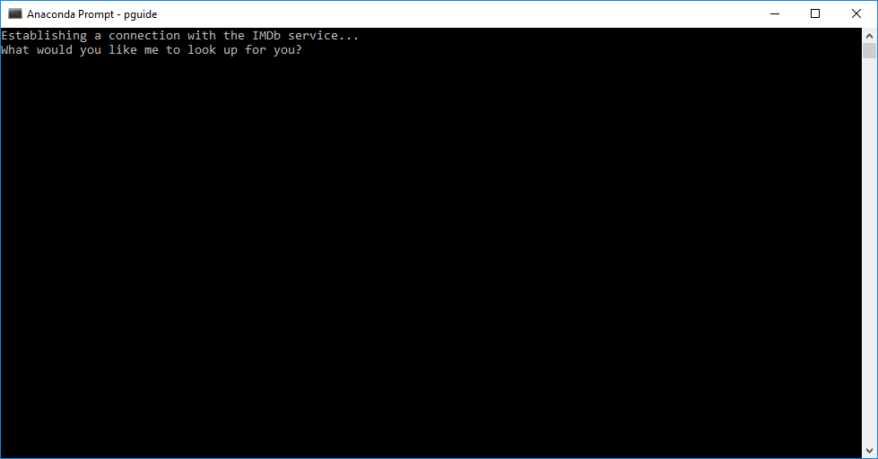
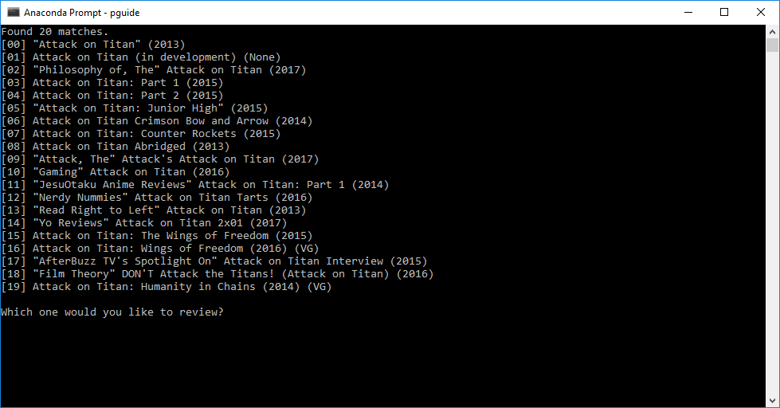
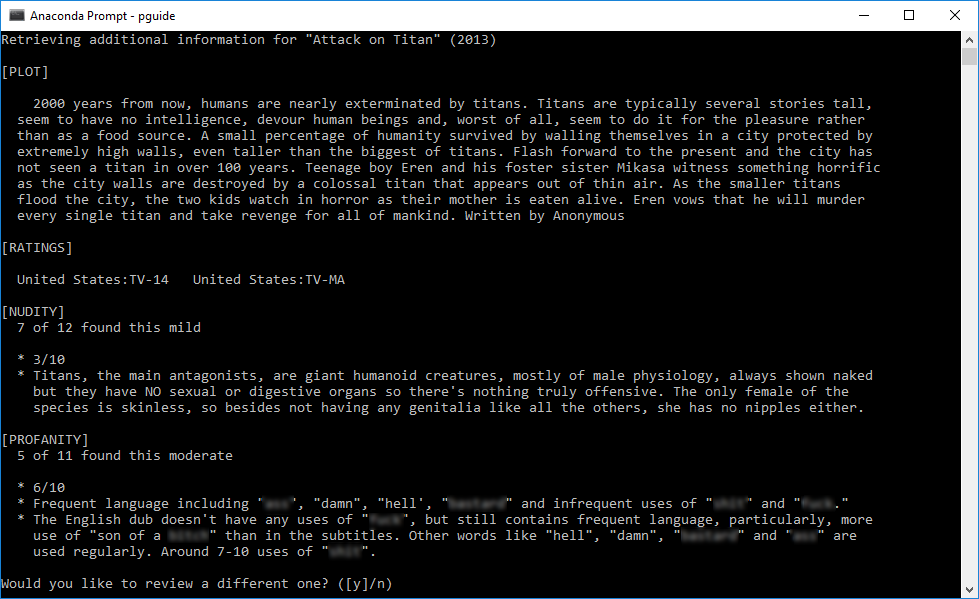

# Parental Guide (pguide)
> Parental Guide assistant for media that uses IMDbPY.

![Python version][python-version]
[![Build Status][travis-image]][travis-url]
[![BCH compliance][bch-image]][bch-url]
[![GitHub issues][issues-image]][issues-url]
[![GitHub forks][fork-image]][fork-url]
[![GitHub Stars][stars-image]][stars-url]
[![License][license-image]][license-url]

> NOTE: There is an issue with IMDbPY module that I was using it. I'll have to drop it and code my own scraper. Sorry for the inconvenience.

My kids are big movie and anime buffs and are constantly asking me to look up shows to see if they are allowed to watch them. This of course takes time, more so when they bring you a list of them!

I wrote this script to help me out with that task. I was surprised to discover that it also worked for video games! I did use [IMDbPY](https://github.com/alberanid/imdbpy) to help with the initial searching.

## How to set it all up
First of all, you should setup a virtual environment. I've included both a *requirements.txt* and an *environment.yml* file in order to make things easier. Perform the steps in the *Initial* and *Final* setups but do either the *Anaconda* or *Python* ones depending on which one you prefer to work with.

#### Initial setup
```bash
cd Projects
git clone https://github.com/clamytoe/pguide.git
cd pguide
```

#### Anaconda setup
```bash
conda env create
```

#### Regular Python setup
```bash
pip install -r requirements.txt
```

#### Final setup
```bash
activate pguide # or source activate pguide
python setup.py install
```

## How to run
Once that's all out of the way simply run the program and follow the prompts.

```bash
pguide
```

## Sample run






Just hitting the *ENTER* key will continue with the next screen. To exit enter an *n*.

[python-version]:https://img.shields.io/badge/python-3.6.3-brightgreen.svg
[travis-image]:https://travis-ci.org/clamytoe/pguide.svg?branch=master
[travis-url]:https://travis-ci.org/clamytoe/pguide
[bch-image]:https://bettercodehub.com/edge/badge/clamytoe/pguide?branch=master
[bch-url]:https://bettercodehub.com/
[issues-image]:https://img.shields.io/github/issues/clamytoe/pguide.svg
[issues-url]:https://github.com/clamytoe/pguide/issues
[fork-image]:https://img.shields.io/github/forks/clamytoe/pguide.svg
[fork-url]:https://github.com/clamytoe/pguide/network
[stars-image]:https://img.shields.io/github/stars/clamytoe/pguide.svg
[stars-url]:https://github.com/clamytoe/pguide/stargazers
[license-image]:https://img.shields.io/github/license/clamytoe/pguide.svg
[license-url]:https://github.com/clamytoe/pguide/blob/master/LICENSE
